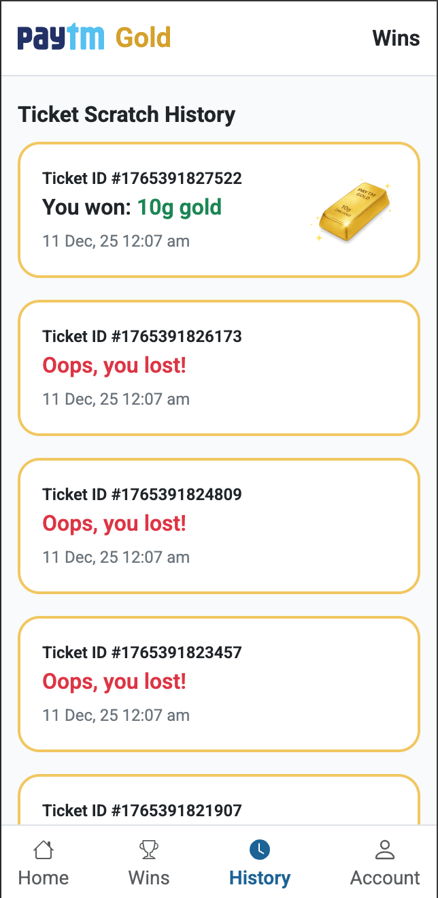
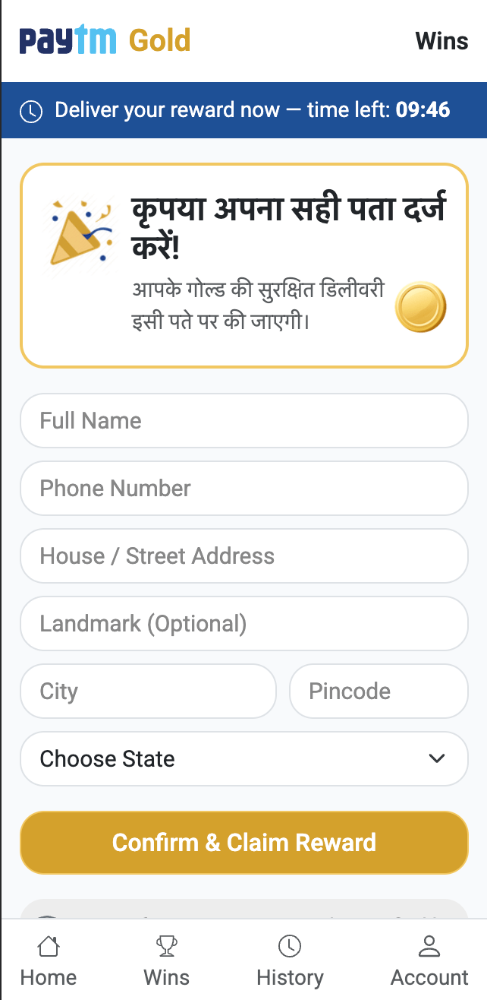
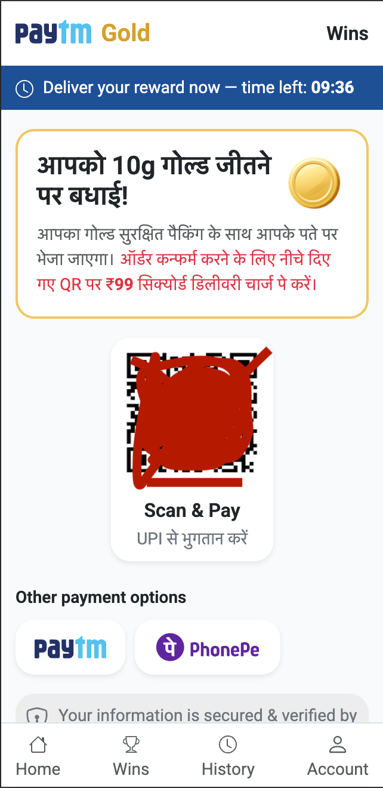

# 💰 Paytm Gold Clone Website Script

A **Paytm Gold–inspired platform clone** that allows users to explore digital gold buying & selling features with a modern, responsive UI.

---

## 📌 Project Name

**paytm-gold-clone-website-script-download**

Download PayTm Gold platform clone website script.

---

## 🚀 Project Overview

✔ Clean & modern fintech-style UI  
✔ Fully responsive (mobile, tablet, desktop)  
✔ Easy to customize & deploy  
✔ Ideal for demos, startups, and learning projects

✔ <b>Tech Stack: HTML, Javascript</b>

---

## 🖥️ Demo Access

For demo access, purchase and other information, please email us at:

**📧 thb_dev@proton.me**

---

## 📸 Screenshots

  

  

  

  

  

  

---

## ⚙️ Features

- 🟡 Digital Gold Buy & Sell UI
- 📊 Wallet and transaction screens
- 🔐 Authentication-style pages
- 📱 Mobile-first responsive layout
- 🎨 Modern fintech design
